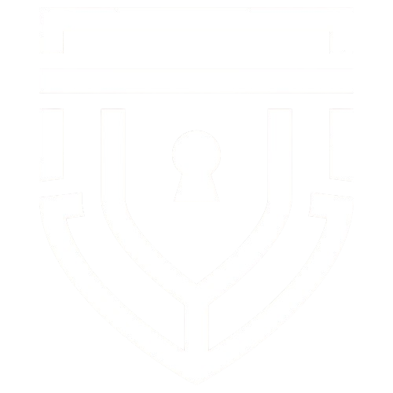

# AccFo: Modern Zero-Knowledge Password Vault & Account Manager



**AccFo** is an open-source, zero-knowledge web application designed for responsive performance across phones, tablets, laptops, and desktops. AccFo pairs a **Dark Night (`#000F08`)** and **Imperial Red (`#FB3640`)** theme with client-side **AES-256-GCM** encryption and native **Local File Ownership** via the File System Access API.

---

## Core Capabilities

### Client-Side Zero-Knowledge Encryption

- **PBKDF2-HMAC-SHA256**: 600,000 key derivation iterations for brute-force resistance.
- **AES-256-GCM**: Authenticated 256-bit symmetric encryption for all credentials with unique 12-byte initialization vectors (IVs).
- **Zero-Cloud Architecture**: Plaintext passwords and cryptographic keys never leave your browser memory.

### Local File Ownership (File System Access API)

- Directly link a physical `.accfo` vault file from your device (`showOpenFilePicker` / `showSaveFilePicker`).
- Modifications are auto-saved directly to your local file in real-time.
- Fallback support for mobile devices and non-Chromium browsers with encrypted IndexedDB caching and one-click `.accfo` backup export/import.

### Cross-Device Self-Hostable Sync

Synchronize your encrypted vault across devices without relying on proprietary cloud vendors:

- **WebDAV / Nextcloud / ownCloud**: Standard HTTP WebDAV integration with App Tokens.
- **S3 / MinIO Object Storage**: Native AWS SigV4 encrypted vault bucket synchronization.
- **Self-Hosted AccFo Sync Micro-Server**: Bundled zero-dependency Python (`sync_server/server.py`) and Node.js (`sync_server/server.js`) servers with Docker support.

### Password Generator & CSPRNG Engine

- Cryptographically secure random password generation with customizable lengths (8–64 characters) and character sets (uppercase, lowercase, digits, symbols, ambiguous exclusion).
- Live entropy calculation and crack time estimations.
- Memorable multi-word passphrase generator.

### Security Health Audit

- Automated analysis detecting weak passwords, reused credentials, and overall vault health score.
- Direct password upgrade workflow.

### Universal Import & Migration

- Import from standard CSV files, Bitwarden JSON exports, and native AccFo `.accfo` archives.

---

## Quick Start

### Running the Web Application Locally

Run AccFo locally with Python or Node.js:

#### Using Python:

```bash
python -m http.server 8080
```

Then open [http://localhost:8080](http://localhost:8080) in your browser.

#### Using Node.js:

```bash
npx serve .
```

---

## Self-Hosting the Sync Server (Optional)

For cross-device synchronization between your phone, laptop, and desktop:

### 1. Python Server (Zero Dependencies):

```bash
python sync_server/server.py 8765 my_secret_token
```

### 2. Node.js Server:

```bash
node sync_server/server.js 8765 my_secret_token
```

### 3. Docker:

```bash
docker build -t accfo-sync -f sync_server/Dockerfile .
docker run -d -p 8765:8765 -e ACCFO_SYNC_TOKEN="my_secret_token" accfo-sync
```

Then in AccFo -> **Storage & Sync**, select **Self-Hosted Server** and enter `http://<your-ip-or-domain>:8765/api/vault` along with your auth token.

---

## Design System

- **Dark Night (`#000F08`)**: Dark surfaces, glassmorphic card containers, and ambient glow.
- **Imperial Red (`#FB3640`)**: Action buttons, active navigation indicators, badges, and focus rings.
- **Emerald (`#10B981`)**: Security validation indicators and sync status pills.
- **Typography**: _Outfit_ & _JetBrains Mono_ (Google Fonts).

---

## Author & Attribution

Developed and maintained by **Vaibhav K Joshi** (aka **[ImMortaLGuruji](https://github.com/ImMortaLGuruji)**).

---

## License

This project is open source and available under the terms of the [MIT License](LICENSE.txt) &copy; 2022 - 2026 **Vaibhav K Joshi** (aka "ImMortaLGuruji").
